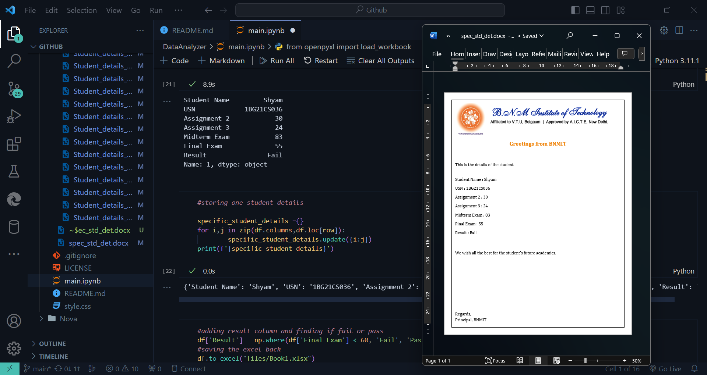

# DataAnalyzer

Data Analyzer is a python application for converting Excel docs to Word and use them for analytics.

Just run the main.ipynb after cloning

the output will be in the output folder:
Specific student and all students

You can add your own excel sheets in the files folder instead of Book1
you can also modify the input word file

Sample Output:

